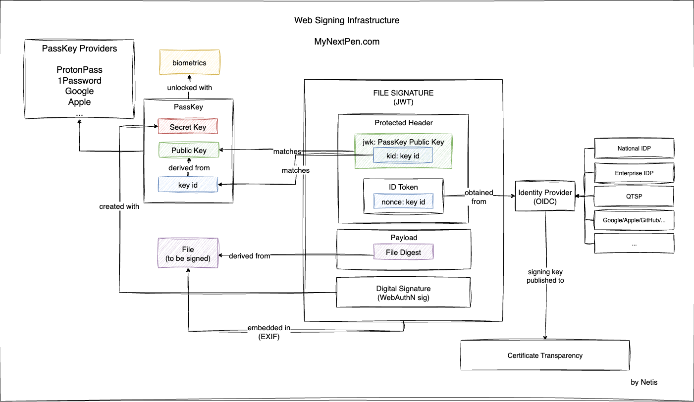

# Web Signing Infrastructure <!-- omit in toc -->

Digital signatures are a cornerstone of secure communication, ensuring
authenticity, integrity, and non-repudiation in digital transactions.
Traditional digital signature infrastructures, however, face two persistent
challenges: (i) the complexity of obtaining and managing X.509 certificates for
end users, and (ii) the difficulty of securely storing and using private signing
keys without relying on specialized hardware or centralized services.

We address these limitations by leveraging two widely adopted standards: OpenID
Connect (OIDC) and WebAuthn/Passkeys. First, we show how an identity provider
(IdP) can bind a user’s public key to an OIDC-issued identity token, providing a
practical alternative to certificate-based identity binding. Second, we
demonstrate how WebAuthn’s secure, device-bound, and biometrically protected key
management can be repurposed to support digital signing, enabling users to
generate and use cryptographic keys directly within their browsers.

By combining these mechanisms, we propose a Web Signing Infrastructure that is
decentralized (keys remain on user devices, IdPs are user-selectable), scalable
(built on existing and widely deployed standards), and secure (benefiting from
device binding, biometric protection, and phishing resistance). Our approach
eliminates the need for centralized signature services, reduces deployment
complexity, and makes digital signing accessible to a broad user base through
lightweight, stateless protocols.
  
## Overview

## Specifications

- [Binding a PassKey to an ID Token Using OpenID Connect (OIDC)](./id-token-binding.md)

## Demo

[MyNextPen](https://mynextpen.com/) is a an implementation of the protocol.

## Roadmap

Other parts of the specifications will be published shortly.

## License

See the [LICENSE](./LICENSE)
